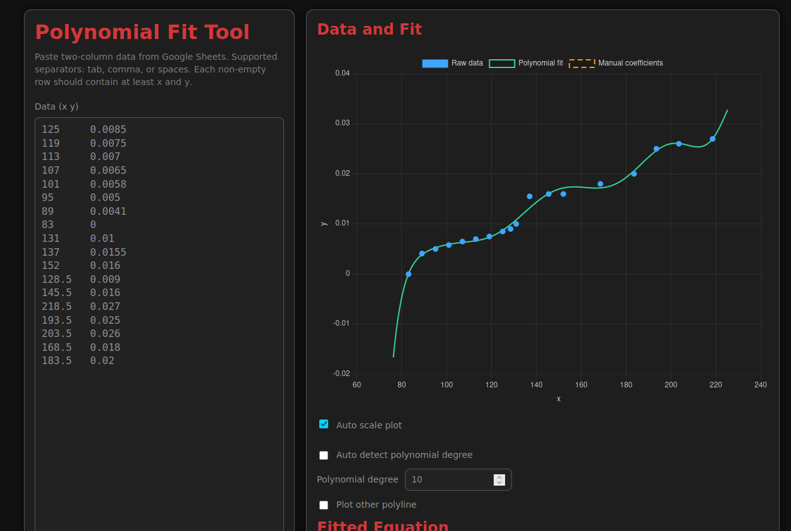
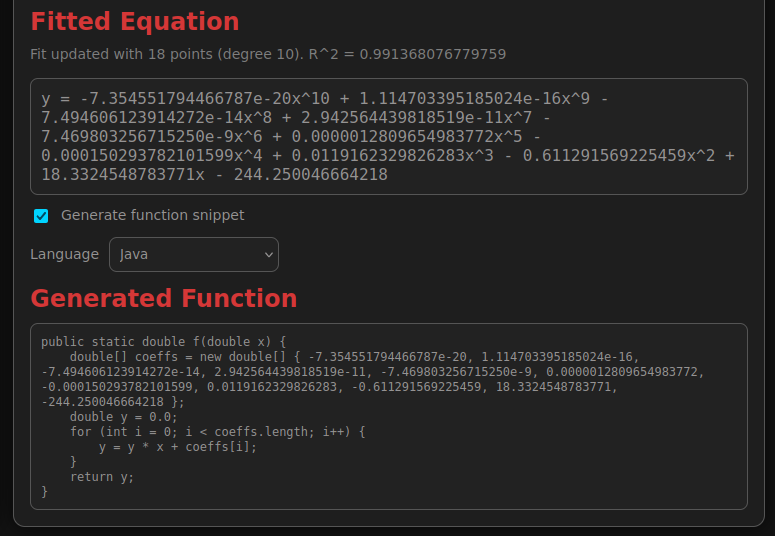
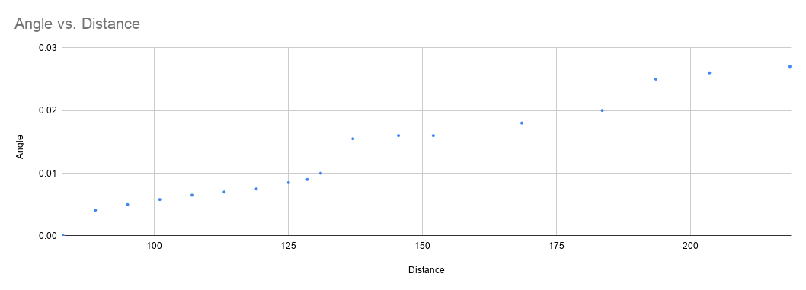
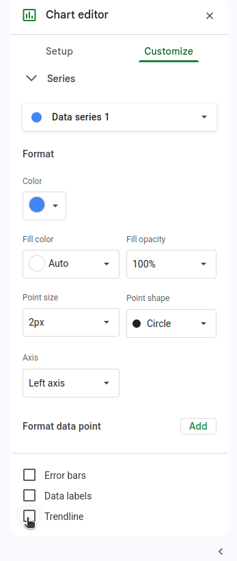
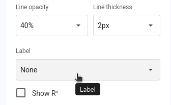
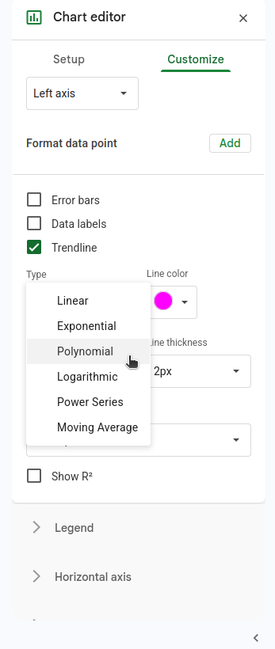
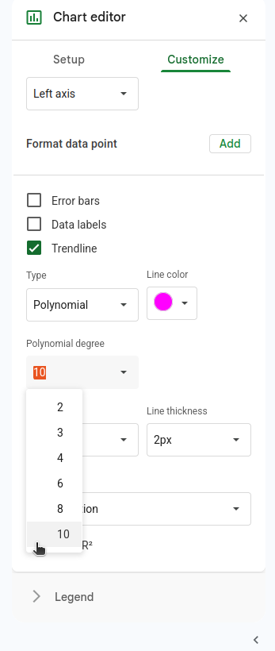
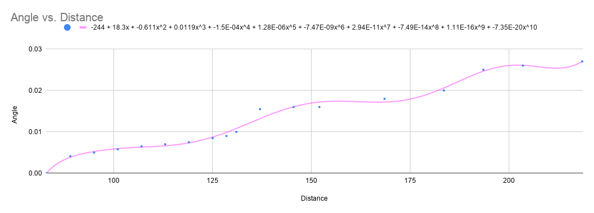

# Shooter Curve

Our team typically calibrates robot shooting mechanisms purely empirically (i.e. gather real world data), without 
using any kind of base model. We fit an `n`th degree polynomial to a 2d set of data (distance, angle), then use this equation 
in our code to compute the required shooter angle based on our calculated distance from the target. We typically keep the 
shooter wheel velocity constant.

# Example

Say you collected the following data from your robot and recorded it in Google Sheets. Distance is distance from the shooter to the target
(straight horizontal) and angle is the angle of the mechanism to achieve that distance.

|Distance|	Angle|
| --- |---------|
|125	| 0.0085  |
|119| 	0.0075 |
|113| 	0.007  |
|107| 	0.0065 |
|101|	0.0058|
|95|	0.005|
|89|	0.0041|
|83|	0|
|131|	0.01|
|137|	0.0155|
|152|	0.016|
|128.5|	0.009|
|145.5|	0.016|
|218.5|	0.027|
|193.5|	0.025|
|203.5|	0.026|
|168.5|	0.018|
|183.5|	0.02|

## Polyfit

Copy & paste your data from Google Sheets into [Polyfit](https://cknutson.org/polyfit.html):

Set your polynomial degree to best fit the line to the data.

Check the "Generate function snippet" box to generate the appropriate Java, C++, or Python code for the equation:

## Google Sheets

You can plot your two data columns in Google Sheets to generate the following graph:

Next, we want to generate a trendline to fit our nth degree polynomial to our data. Google sheets makes this simple. Edit your 
chart, go to "Customize", then "Series", then check the "Trendline" box.

Change the trendline "Label" to "Use Equation"

Change the "Type" from "Linear" to "Polynomial".

You can then set your "Degree" to make the trendline fit the data 
the best, usually around 6-8. 

Now you have your scatter plot of data points with your nth degree polynomial fit.

The equation at the top of the graph calculates the shooter angle (y) for any given distance (x). However, since we're only given 
3 sig figs of precision with the coefficients, if you were to copy-paste this into code, your equation would give you
significantly incorrect values. So, use a tool like TODO mentioned above to get the high precision coefficients.